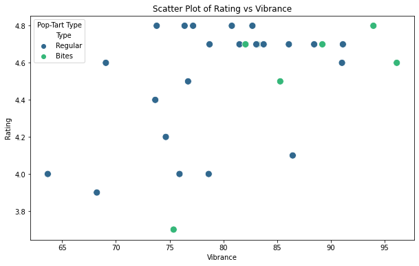
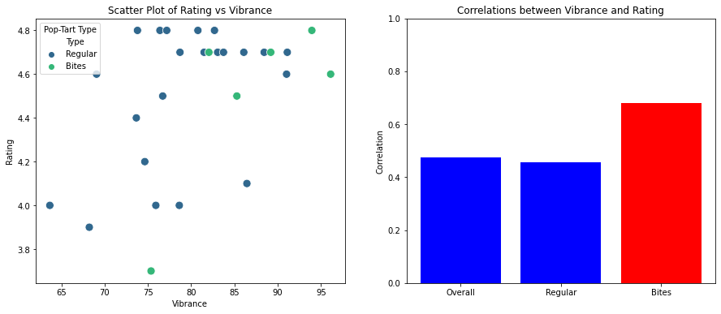
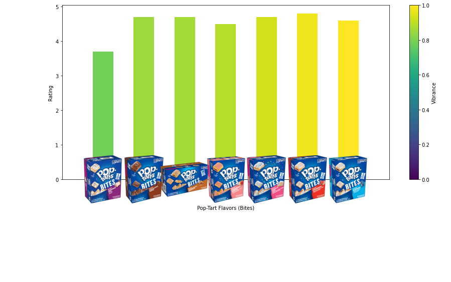
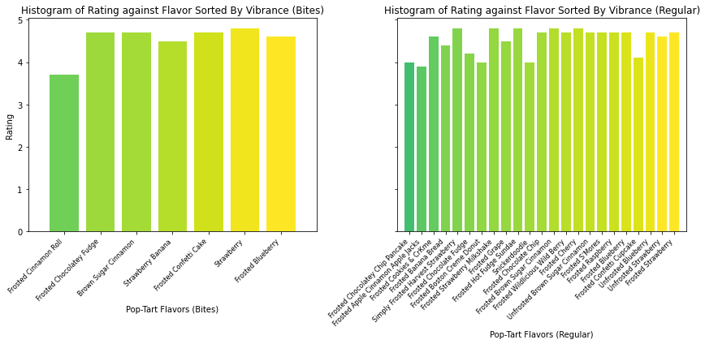

# Pop Tart Box Analysis

This directory contains files and instructions for analyzing Pop Tart boxes.

## Instructions

1. **Install imutils:** Make sure you have the imutils library installed in your Python environment. You can install it using pip:
    ```
    pip install imutils
    ```

2. **Upload pop-tart box images dataset.zip:** Upload the `pop-tart box images dataset.zip` file located in the same folder as this README to the directory where you are currently working on.

3. **Unzip pop-tart box images dataset.zip:** Execute the following code in a cell below to unzip the `dataset.zip` file:
    ```python
    import zipfile
    with zipfile.ZipFile('pop-tart box images dataset.zip', 'r') as zip_ref:
        zip_ref.extractall('.')
    ```

4. **Upload pop_tart_imgs.csv:** Similarly, upload the `pop_tart_imgs.csv` file located in the same folder as this README to the directory where you are currently working on.

5. **Unzip pop_tart_imgs.csv:** Execute the following code in a cell below to unzip the `pop_tart_imgs.csv` file:
    ```python
    with zipfile.ZipFile('pop_tart_imgs.csv.zip', 'r') as zip_ref:
        zip_ref.extractall('.')
    ```

## Directory Contents

- **Pop Tart Box Analysis.ipynb:** This Jupyter notebook contains the finalized code for analyzing Pop Tart boxes.

- **pop-tart box images dataset.zip:** This zip file contains the dataset of Pop Tart box images.

- **pop_tart_imgs.csv:** This CSV file contains additional information about the Pop Tart images.

## Expected Output

### Visualizations

- **Vibrance vs Rating Scatterplot:**  
  

- **Vibrance Rating Correlation:**  
  

- **Box Cover Vibrance Ratings:**  
  

- **Rating Flavor Vibrance Histogram:**  
  

## Notes

- Ensure that you execute the provided code snippets to properly set up the environment and extract necessary files.

- Make sure to follow the instructions carefully to ensure smooth execution of the analysis.
